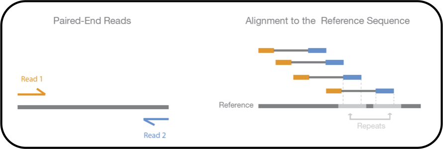

# Team 31: Read Mapping to Genomes using STAR
1. [Background](#311) 
2. [History of RNA Sequencing](#312) 
3. [Setting Up](#313) 
4. [Ways of Fixing the Ambiguous Mapping Problem](#314) 
5. [Improving the Process](#315) 
6. [STAR Background Information](#316) 
7. [Overview of STAR Steps](#317) 
8. [Applications](#318) 
9. [Potential Errors](#319) 
10. [Different Tools for BAM Mapping to Genome](#3110) 
11. [References](#3111) 

## 1. Introduction
## 2. History of RNA Sequencing
## 3. Setting Up

To actually start mapping, we need two things: 
- reads
- reference genome
  
We are going to be mapping the reads to the reference genome. The reason we use a reference genome and not a specifically built genome is because it takes up a lot of memory and time. But there is also another reason. Any differences between the mapped reads and the reference could be attributed to mutations. The next step is to actually map the reads. The initial approach was to brute force pattern matching. Essentially taking the read and moving downstream until a match is found. But while this works well for short genomes and single reads, it doesn’t work for hundreds of reads and a full genome length. If we imagine the genome as a book, and a read as a phrase, what we are essentially trying to do is skim through the book to find the phrase. But what happens if there is a typo in the phrase, or a mutation in the read? One solution we just have is to just tell the program that we are using that it’s okay if there isn’t an exact match. Let's say, for example, that we want a 99% similariy between a read and the genome. This allows for single nucleotide polymorphisms to be kept in, and since the match is mostly exact, we can continue mapping. 

## 4. Ways of Fixing the Ambiguous Mapping Problem

Another problem that exists in read mapping is ambiguous mapping. Assume that the genome resembles a puzzle, and a read is a puzzle piece. In some cases, a piece can look like it fits into multiple spots. This is essentially what goes on with ambiguous reads. One read could map to multiple locations. (Using the book metaphor from the previous section, one phrase could be present in multiple pages) A way to solve this is to use paired end reads, which are reads that are read both forwards and backwards. Looking at the read from both directions can give us clues as to what spot the read belongs in. Going back to the puzzle metaphor, let’s assume we have this piece below.

If we look at it from just the top, we would put it in the blue area. If we look at it from the bottom, we would put it in either the purple or pink area. Looking at it from both directions gives us a better understanding of the location of the piece. Paired end reads work the same way, as they are read both forward and backwards. This gives us clues as to the exact location of the read.

The next step is to make sure that the reads map well. (This is also useful to see if the correct location is chosen for the ambiguous read). For this we need to calculate a mapping quality, which is the probability that the mapping is incorrect. This is calculated using the individual read base qualities. If the quality is good, then we can feel confident in our mapping location of the read. And it’s this whole process in which STAR comes in.

## 5. Improving the Process
## 6. STAR Background Information
## 7. Overview of STAR Steps
## 8. Applications

One application for STAR read mapping is that we can identify mutations and variants. If there are enough small differences in the lineage we are studying, then we can say that it is a variant of the original lineage. These variants can then be studied to make vaccines, if the genome that we are studying is a virus. This is clearly shown today when looking at covid. Another application is identifying gene expression levels. If one gene is expressed in greater levels than before, then with read mapping, we can identify the sequence that corresponds to said gene. Once that is identified, we can then conduct experiments to figure out what exactly that read does for gene expression. This could be applied to studying various diseases which cause, or are caused by, changes in gene expression levels. 

## 9. Potential Errors
## 10. Different Tools for BAM Mapping to Genome
## 11. References
